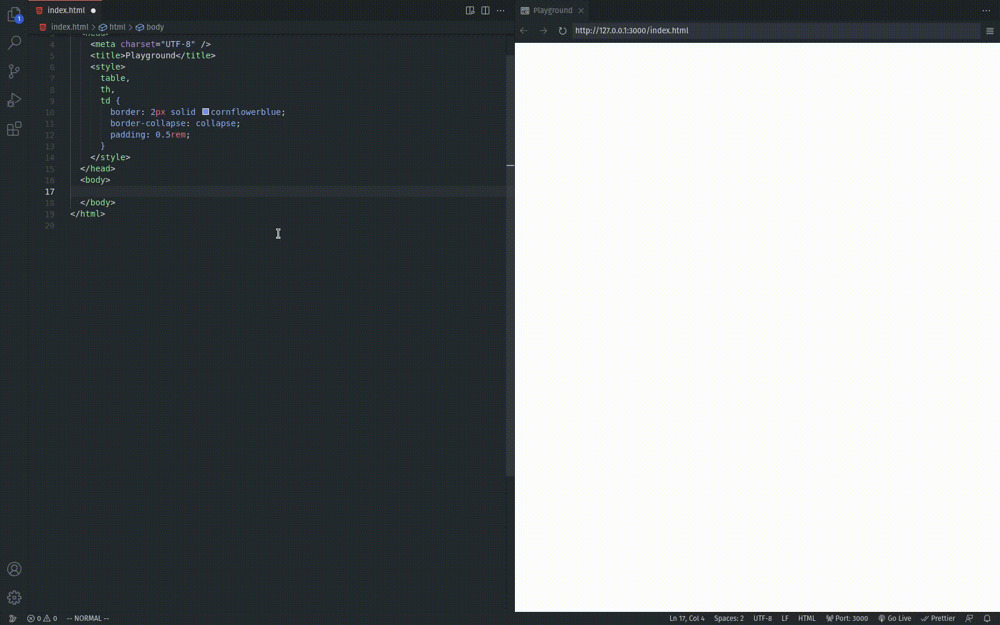

# paste-fix

Primarily made to remove irregular whitespace characters, which we get when we copy and paste content from OneNote.

## Features

Replaces the following irregular whitespace characters with the regular space:

- \u000B - Line Tabulation (\v) -
- \u000C - Form Feed (\f) -
- \u00A0 - No-Break Space -
- \u0085 - Next Line
- \u1680 - Ogham Space Mark
- \u180E - Mongolian Vowel Separator -
- \ufeff - Zero Width No-Break Space -
- \u2000 - En Quad
- \u2001 - Em Quad
- \u2002 - En Space -
- \u2003 - Em Space -
- \u2004 - Three-Per-Em
- \u2005 - Four-Per-Em
- \u2006 - Six-Per-Em
- \u2007 - Figure Space
- \u2008 - Punctuation Space -
- \u2009 - Thin Space
- \u200A - Hair Space
- \u200B - Zero Width Space -
- \u2028 - Line Separator
- \u2029 - Paragraph Separator
- \u202F - Narrow No-Break Space
- \u205f - Medium Mathematical Space
- \u3000 - Ideographic Space

Without this extension 😔:

With this extension 🥳:

