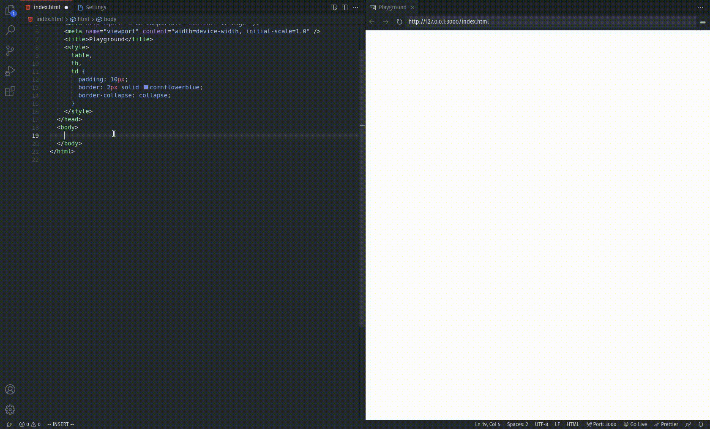

# Paste Fix

Primarily made to remove irregular whitespace characters, which we get when we copy and paste content from OneNote.

## Features

- Automatically replaces (the user can opt out in the settings) irregular whitespaces when **pasting** content.
- Adds "Replace Irregular Whitespaces" command which replaces all irregular whitespaces in the current active document.

Without this extension 😔:

With this extension 🥳:

With "Replace On Paste" turned off:

## Feedback

If you are experiencing unexpected behavior or want to request a feature, please open an issue in the [paste-fix github repository](https://github.com/dragi-ns/paste-fix).
